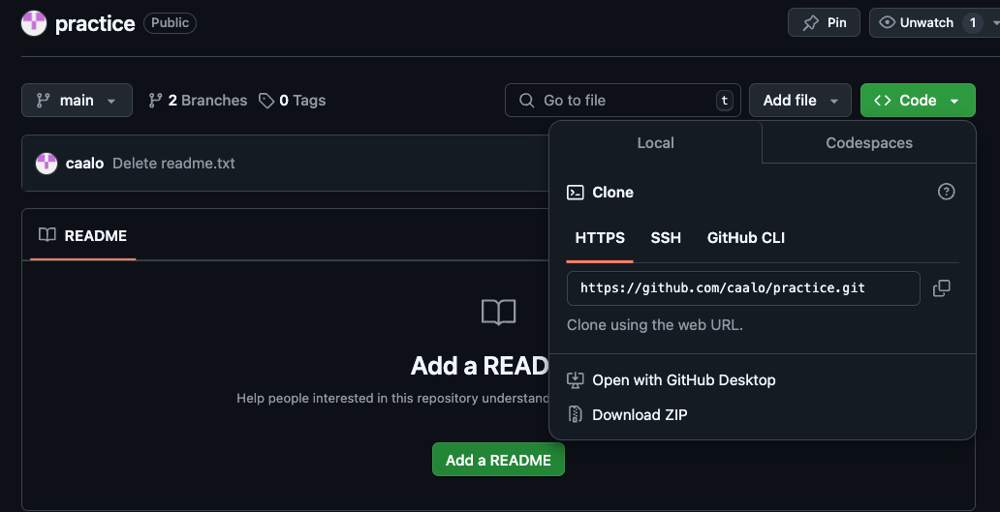

```{r, include = FALSE}
ottrpal::set_knitr_image_path()
```

# Workshop Notes

## Review of Intro to Git

During the Intro to Git workshop, discussed the Git Data Model. Git keeps track of a project within a designated directory, which is called a **repository** (also known as **repo**). You can save the state of your repository by making a **commit**: Git will save the repository's directory tree, a link to the previous commit, and metadata.

This process is illustrated below:


This can also be illustrated with symbols below:

```         
o <-- o <-- o <-- o
```

where each `o` is a commit of the repository's state.

This basic Git Data Model is great when you are working on a project by yourself, but when you start collaborating with others, your project development may become more complicated. How can we keep track of multiple people's work clearly and transparently without stepping on each others' toes?

Suppose we start a project in a linear commit structure, as before:

```         
o <-- o <-- o <-- o
```

Suppose that another collaborator joins in and wants to develop a separate feature, while you continue on the project. It is possible to create a **branch** structure, in a situation where two separate features of the project are being made in parallel:

```         
o <-- o <-- o <-- o
            ^
             \
              --- o <-- o
```

When both features are complete, one could merge them together to have an unified, unbranched repository:

```         
o <-- o <-- o <-- o <---- o
            ^            /
             \          v
              --- o <-- o
```

This process in Git is called **branching**, when two branching commit paths are created, and **merging**, when two branches are integrated together.

This branch and merge workflow can be used for collaborative projects, but can also be useful for a single user. A project maintained by one developer may branch out into various working ideas, and this branch and merge workflow keeps track of that nicely.

## Set-up

### Setting up the command line to connect with GitHub

For this workshop, we practice interacting with Git and GitHub using the Command Line. Because everyone's computer is different, we practice using Posit Cloud, which has an online Command Line interface. You should sign up and login, and then access this [Posit Cloud workspace](https://posit.cloud/content/7843782). Open up `workshop.qmd` via the file browser on the bottom right corner. Then, on the bottom panel, click on the "Terminal" tab. This will be the Command Line we will be using today.

Copy and paste the following commands into the "Terminal" tab, pressing enter after each command:

```         
curl -sS https://webi.sh/gh | sh
```

```         
git config --global user.email "you@example.com"
git config --global user.name "username"
gh auth login
```

You will then several questions, and here is how you should respond:

```         
? What account do you want to log into? GitHub.com
? What is your preferred protocol for Git operations? HTTPS
? Authenticate Git with your GitHub credentials? Yes
? How would you like to authenticate GitHub CLI? Login with a web browser
```

You will be given a code, and you will provide that code to GitHub via <https://github.com/login/device>.

You should accept the permissions GitHub asks you to grant, and when this is complete, you will be connected to GitHub!

### Setting up a new repository

Go to: <https://github.com/new>.

Give it a repo name, set it to public, create a README.

Find the clone URL by clicking on "Code", and copy the address (in this image, it is [`https://github.com/caalo/practice.git`](https://github.com/caalo/practice.git), but it will differ for you.)



Return to Posit Cloud's Terminal. Let's bring the GitHub repository locally on to Posit Cloud:

```         
git clone your_clone_URL
```

where `your_clone_URL` is the address you just copied.

And then look into that directory:

```         
cd your_repo_name
```

Now you are ready to start making local commits!

## Making commits

Let's run `git status` to understand the current state of this repository.

```         
git status
On branch main
Your branch is up to date with 'origin/main'.

nothing to commit, working tree clean
```

We will update files in this repository, and make our first commit. We will update a file, and commit it to our repository. Before we do so, we have some more concepts to unpack.

In addition to the Git Data Model, there is a Staging Model to keep in mind when trying to make commits. In the simplest version control system, one could imagine a commit command that takes a snapshot of the repository's directory and stores it as the commit. In Git, there is an intermediate **staged** state so that you can selective decide which files from your repository should be in the commit.

Why offer this intermediate staging ground? Perhaps, in a rush, you implemented two modular changes to your code in two different files, respectively. You want to make two separate commits, one for each change, so you stage one file, commit that one file, and then stage the second file, and then commit that second file. Or perhaps, during your analysis, you generated a bunch of temporary files that isn't necessary for the software to run, so you don't stage these temporary files to commit. Or perhaps, *you have sensitive PHI data in your repository's directory and should not commit it*.

Once Git **tracks** your file, Git has three main states that your files can reside in: **modified**, **staged**, and **committed**:

-   **Modified** means that you have changed the file but have not committed it to your local repository yet.

-   **Staged** means that you have marked a modified file in its current version to go into your next commit.

-   **Committed** means that the data is safely stored in your local repository.

This can be summarized in the following diagram:


Let's try this out:

Using the file browser, open up `README.md` and modify it, adding some text to it. Save it. (If you do not have a `README.md` file, you can create a custom text file via File -\> New File -\> Text File)

```         
git status

On branch main
Your branch is ahead of 'origin/main' by 1 commit.
  (use "git push" to publish your local commits)

Modified files:
  (use "git add <file>..." to include in what will be committed)
    README.md

nothing added to commit but untracked files present (use "git add" to track)
```

Let's stage it:

```         
git add README.md
```

Check the status again:

```         
git status
On branch main
Your branch is ahead of 'origin/main' by 1 commit.
  (use "git push" to publish your local commits)

Changes to be committed:
  (use "git restore --staged <file>..." to unstage)
    new file: README.md
```

The file is staged and ready to be committed.

```         
git commit -m "your commit message"
```

where you can decide what your message is.

You should practice making a few more commits to get familiar with this!

## Pushing to GitHub

Once you are comfortable with commits, you can update your repository back to GitHub. When you want to share your repository to a remote, such as GitHub, you use `git push`. If you have any collaborators also pushing to the same repository and you want to see their updates, you use `git pull` to get the remote changes to your local repository.

Let's update our Git Data Model with push:

-   **Untracked** means that your file is in the local repository file directory, but is not being tracked by Git.

-   **Modified** means that you have changed the file but have not committed it to your local repository yet.

-   **Staged** means that you have marked a modified file in its current version to go into your next commit.

-   **Committed** means that the data is safely stored in your local repository.

-   **Pushed** means that the your changes have been made to the remote (ie. GitHub).

Our diagram, updated:


Let's run it:

```         
git push
Enumerating objects: 5, done.
Counting objects: 100% (5/5), done.
Delta compression using up to 8 threads
Compressing objects: 100% (3/3), done.
Writing objects: 100% (3/3), 313 bytes | 313.00 KiB/s, done.
Total 3 (delta 1), reused 0 (delta 0), pack-reused 0
remote: Resolving deltas: 100% (1/1), completed with 1 local object.
To https://github.com/fhdsl/Collaborative_Git_GitHub_Student_Practice.git
   6e97634..0c82b47  main -> main
```

If you refresh your GitHub repository, you should see the changes!

## Branching

Now we think about collaborative work, in which we create branches to isolate our own work before merging it back to the main branch.

We first create a branch, called `clo2_development`, on our remote repository. You can subsitute "clo2_development" with your own identifier.


The branch `clo2_development` is created on the GitHub remote, but it hasn't been updated locally. We run `git pull` locally to update it.

```         
% git pull
From https://github.com/fhdsl/S2_Collaborative_Git_GitHub_Student_Practice
 * [new branch]      clo2_development -> origin/clo2_development
Already up to date.

% git checkout clo2_development
Branch 'clo2_development' set up to track remote branch 'clo2_development' from 'origin'.
Switched to a new branch 'clo2_development'
```

Now, switch to that branch via `git checkout clo2_developmenet`.

```         
% git checkout clo2_development
Branch 'clo2_development' set up to track remote branch 'clo2_development' from 'origin'.
```

We can use `git checkout main` to look switch back to our main branch.

We can also use `git branch` to see the branches on a repository.

Now, we will make changes to the branch: let's create a file that is unique to you. You can create a new file via File -\> New File -\> Text File, and save it after you write something. Let's add, commit, and push this new file within our branch.

```         
git add new_file.txt
git commit -m "Created new_file.txt"
git push
```

Now, your remote branch is a different version of the remote main branch with new improvements, both locally and on GitHub!

## Merging and Pull Requests

Eventually our goal is to merge these improvements back to the main branch. To start this process of bringing in new changes, we will create a **pull request**.

When you have pushed changes to the branch, you will see an option to *"Compare & pull request"* on the GitHub website. Click on it. (If it is not there, click on Pull Requests -\> New Pull Request.)


A **pull request** is a way to propose changes from a branch before it is merged back into the main repository. For instance, a collaborator can create their own work on a branch, and then create a pull request to have that new branch's feature to be integrated back to the main branch. The owner of the repository sometimes review the proposed changes before accepting the pull request.

You will see that you are trying to merge `clo2_development` into `main` on the remote. It also requires you to write a description of what you did on your branch.


After you create the pull request, the author of the repository gets to decide whether a merge should be done on the pull request. Here, you are a contributing author of the repository, so you can approve it yourself. But you can imagine a situation where you need someone else to approve of the pull request: a dialogue can take place in this approval process, leading to additional commits to be made before the pull request is approved.


Click *"Merge pull request"* to finish!

You should be able to see the new file in the `main` branch now.

## Appendix: Merge conflicts during pull requests

Sometimes, when merging branches together during a pull request, there will be changes that will be in conflicts with each other. GitHub will stop the process and ask you fix it. A nice guide to this can be found [here](https://docs.github.com/en/pull-requests/collaborating-with-pull-requests/addressing-merge-conflicts/resolving-a-merge-conflict-on-github).

## Appendix: Undoing

### Unstage a file

Suppose you staged a file, and then realized you don\'t want the file to be staged for the commit. To unstage the file so that it returns to \"modified\", run `git restore --staged [fileName]`.

### Unmodify a file

After your commit, you make some new changes to a file so that it is \"modified\" You realized that you are no longer interested in this modification and want to un-modify it back to the last commit. Run: `git restore [fileName]`.

*Warning: This cannot be undone!*

### Revert a commit

After several commits, you realized that you wanted to undo a specific commit. Run: `git revert [commit identifier]`. This will undo that commit. However, if the content of that commit has experienced intermediate changes, it will raise a conflict.

You can find the \"commit identifier\" via `git log` to see your commit history.

### Reset to a previous commit

To \"time-travel\" back to a previous commit, run: `git reset --hard [commit identifier]`.

You can find the \"commit identifier\" via `git log` to see your commit history.

*Warning: This cannot be undone!*

## Appendix: Code reviews during a pull request

Suppose that you want someone's approval of your pull request before it is merged. You can add other users in the repository to be a reviewer of your work. This process of code reviewing before a branch is merged is highly recommended in collaborative work.

Some advice for a creating helpful pull requests for reviewers:

-   it provides context of the code changes you made.

-   it asks for explicit feedback of what kind of feedback is needed.

-   it is a a small and modular change that can be discussed.

Some advice for reviewers responding to a pull request:

-   Do the proposed changes answer the solve the problem? Can you test it out in the working branch?

-   Is the code clear and readable? Does it contain a healthy amount of comments and documentation for individuals not familiar with the project to understand generally what is going on?

-   Is the code efficient with computational resources?

-   Does the code stick to the style and conventions of this project?

More advice on code review can be found here for [pull request authors](https://jhudatascience.org/Adv_Reproducibility_in_Cancer_Informatics/engaging-in-code-review---as-an-author.html), and [pull request reviewers](https://jhudatascience.org/Adv_Reproducibility_in_Cancer_Informatics/engaging-in-code-review---as-a-reviewer.html).

## Appendix: GitHub issues

Another nice collaborative feature of GitHub is GitHub issues. GitHub issues are a way for people to give feedback on your repository.

Here is a common scenario of using GitHub issues in the wild: you publish a piece of software on GitHub, and other users try it out. They are confused about how to run your code, because they are getting errors, so they return to the GitHub repository and post a GitHub issue documenting their error. You can then create a branch from this issue, make changes to your code to resolve the error, then use the pull request model to merge it back to the main branch! GitHub issues are also a common way to document to-do features you want to implement in the future.


## Appendix: Getting Git and GitHub on your computer

Downloading and installing Git: [https://git-scm.com/book/en/v2/Getting-Started-Installing-Git](#0 "https://git-scm.com/book/en/v2/Getting-Started-Installing-Git")

If you are on a Mac, you can also download and install Git via Developer Tools.

To connect Git to GitHub, there are a few ways to do it:

-   Via the command line: You can install a command line tool called GitHub Command Line Interface to help you connect to GitHub: [https://docs.github.com/en/github-cli/github-cli/quickstart.](#0 "https://docs.github.com/en/github-cli/github-cli/quickstart") This is how we did it in on Posit Cloud.

-   Via the command line: you can create a [personal access token to connect to GitHub](https://www.youtube.com/watch?v=iLrywUfs7yU "https://www.youtube.com/watch?v=iLrywUfs7yU").

-   Point and click: GitHub Desktop can be downloaded here: <https://desktop.github.com/>. 

-   Point and click: you can connect to GitHub via RStudio (<https://happygitwithr.com/rstudio-git-github>) and VSCode (<https://code.visualstudio.com/docs/sourcecontrol/overview>).

## Appendix: References

-   [ProGit](https://git-scm.com/book/en/v2/Getting-Started-About-Version-Control): We covered chapter 3 in this workshop.

-   [DangItGit](https://dangitgit.com/): Excellent starting point for common Git problems.

-   [MIT's Git Seminar](https://missing.csail.mit.edu/2020/version-control/): A more computer science explanation of how Git works.

-   [Explain Shell](https://explainshell.com/): Access Shell and Git manual and help pages in an easy-to-read way.
